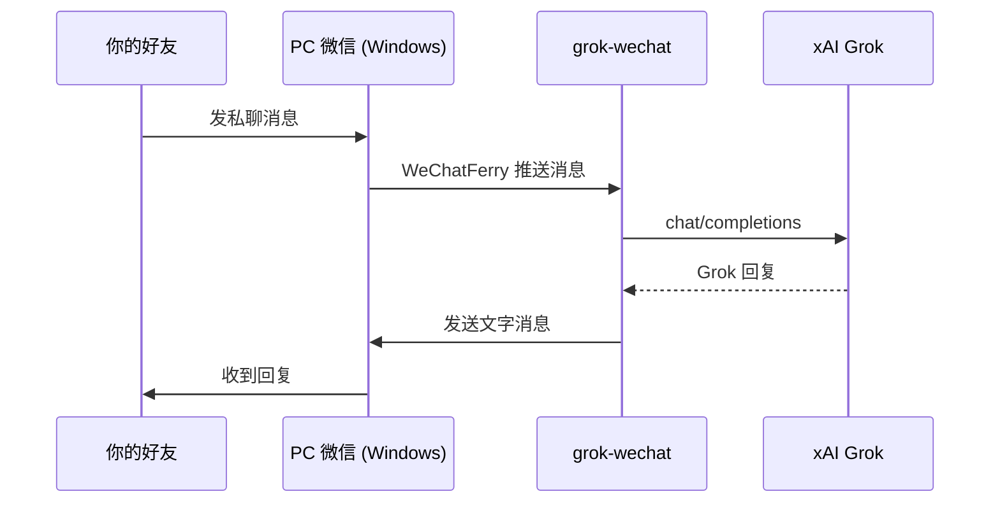

# grok-wechat

把你的**个人微信号**（专用机器人号）接入 **Grok**，好友发私聊消息即可获得 AI 回复。

> 说明：个人微信没有官方开放 API，本项目使用 [WeChatFerry](https://github.com/lich0821/WeChatFerry) 驱动 **Windows 版 PC 微信**。需准备一台 Windows 电脑，用专用微信号登录 PC 微信并保持在线。

## 工作原理



## 你需要准备

1. **一台 Windows 电脑**（或 Windows 虚拟机 / 云服务器）
2. **一个专用微信号**（建议新号或小号，不要用主号）
3. **PC 版微信 3.9.x**（与 wcferry 版本匹配，见 [WeChatFerry 文档](https://github.com/lich0821/WeChatFerry)）
4. **xAI API Key** — [https://console.x.ai/](https://console.x.ai/)

> Mac 用户：在 Windows 电脑上运行本项目；或在 Mac 上写代码，部署到 Windows 执行。

## 一步步设置

### 第 1 步：Windows 上安装 PC 微信

1. 下载安装 **微信 PC 版 3.9.x**（版本需与 WeChatFerry 兼容）
2. 用**专用微信号**扫码登录
3. 保持微信窗口打开（可最小化，不要退出）

### 第 2 步：安装 Python 环境

在 Windows 上打开 PowerShell 或 CMD：

```bat
cd C:\path\to\grok-wechat
python -m venv .venv
.venv\Scripts\activate
pip install -r requirements.txt
```

### 第 3 步：配置 `.env`

```bat
copy .env.example .env
notepad .env
```

至少填写：

```env
XAI_API_KEY=你的xAI密钥
```

其他保持默认即可。若只想让特定好友使用，填写其 wxid：

```env
ALLOWED_WXIDS=wxid_xxxxxxxx
```

### 第 4 步：启动机器人

```bat
.venv\Scripts\activate
python run.py
```

首次启动会等待微信登录完成，日志类似：

```
微信已登录: 小Grok (wxid_xxx)
向机器人发消息即可聊天；发送「重置」清空对话
```

### 第 5 步：测试

1. 用**另一个微信号**给机器人号发消息：`你好`
2. 应收到 Grok 的回复
3. 发 `重置` 可清空对话记忆

## 常用配置

| 变量 | 说明 |
|------|------|
| `XAI_API_KEY` | xAI API 密钥 |
| `GROK_MODEL` | 模型名，默认 `grok-3` |
| `ALLOWED_WXIDS` | 白名单 wxid，留空=所有好友 |
| `REPLY_IN_GROUP` | `true` = 群聊被 @ 时也回复 |
| `WCF_HOST` | 远程 Windows IP（本机运行留空） |
| `MAX_HISTORY_TURNS` | 每个对话保留的轮数 |

## 如何获取好友的 wxid

启动后，在 Python 里临时查询（或看日志里的 sender）：

```python
from wcferry import Wcf
wcf = Wcf()
for f in wcf.get_friends():
    print(f["wxid"], f["name"])
```

## 注意事项

- **封号风险**：个人微信自动化属于非官方方式，建议使用专用小号，控制消息频率
- **Windows 限定**：WeChatFerry 仅支持 Windows + PC 微信，不支持 Mac 版微信
- **微信版本**：升级微信后可能导致失效，需关注 WeChatFerry 更新
- **群聊**：默认只回复私聊；群聊需设 `REPLY_IN_GROUP=true` 且 @ 机器人才回复

## 项目结构

```
app/
├── config.py         # 配置
├── memory.py         # 对话记忆
├── grok/client.py    # Grok API
└── personal/bot.py   # 个人微信机器人主逻辑
run.py                # 启动入口
```