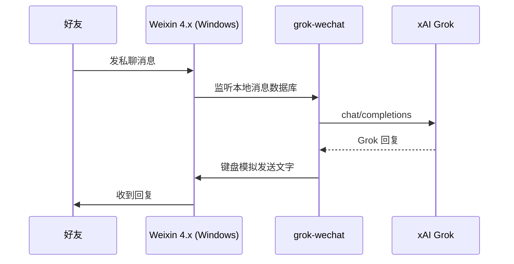
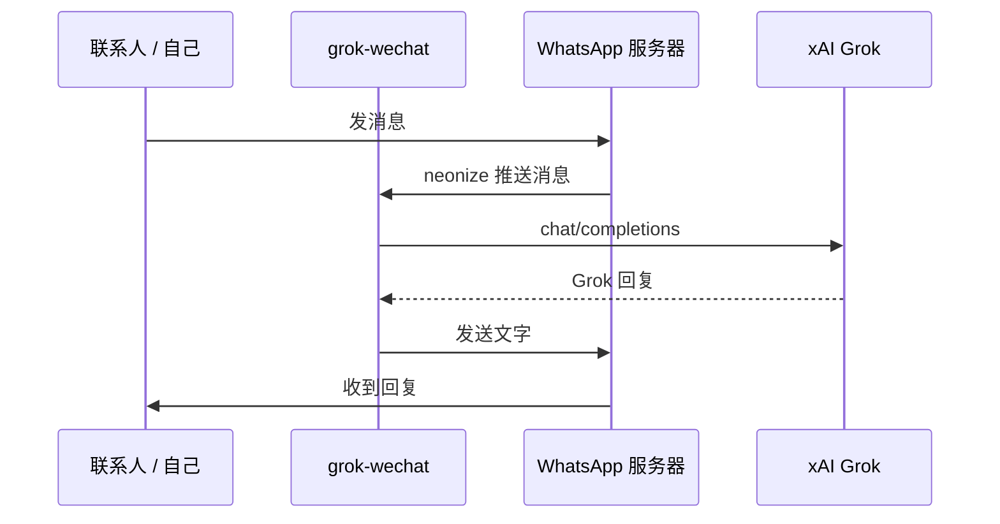

# grok-wechat

把 **Grok** 接到你的即时通讯账号上，好友发消息即可获得 AI 回复。

支持两种渠道：

| 渠道 | 入口 | 说明 |
|------|------|------|
| **微信** | `run.py` | 个人微信号（建议专用小号），多种后端可选 |
| **WhatsApp** | `run_whatsapp.py` | 后台运行，扫码登录，不依赖 PC 客户端 |

## 工作原理

### 微信（默认 `db_keyboard` 模式）



### WhatsApp



## 你需要准备

1. **xAI API Key** — [https://console.x.ai/](https://console.x.ai/)
2. **Windows 电脑**（微信机器人必需；WhatsApp 机器人也推荐在 Windows 上运行）

**微信额外要求**（按后端不同）：

| 后端 | 微信版本 | 额外依赖 |
|------|----------|----------|
| `db_keyboard`（推荐） | Weixin 4.x | [wx_key](https://github.com/ycccccccy/wx_key/releases) 提取数据库密钥 |
| `pyweixin` | Weixin 4.x | 需开启 UI 无障碍（讲述人） |
| `wcferry` | PC 微信 3.9.x | [WeChatFerry](https://github.com/lich0821/WeChatFerry) |

**WhatsApp 额外要求**：手机 WhatsApp 账号，首次启动扫码关联设备即可。

> Mac 用户：可在 Mac 上开发，但微信机器人需部署到 Windows 执行；WhatsApp 机器人理论上也可在 Mac/Linux 运行，本项目主要在 Windows 上测试。

## 快速开始

### 1. 克隆并初始化

```powershell
cd C:\path\to\grok-wechat
powershell -ExecutionPolicy Bypass -File scripts\setup.ps1
```

或手动：

```bat
python -m venv .venv
.venv\Scripts\activate
pip install -r requirements.txt
copy .env.example .env
notepad .env
```

至少填写：

```env
XAI_API_KEY=你的xAI密钥
```

### 2. 启动微信机器人

**推荐方式**：双击 `启动机器人.bat`，或在终端运行：

```bat
.venv\Scripts\python scripts\check_env.py
.venv\Scripts\python run.py
```

首次使用 `db_keyboard` 模式时，还需在 `.env` 配置数据库密钥：

```env
WECHAT_BACKEND=db_keyboard
WECHAT_DB_KEY=你的64位十六进制密钥
```

密钥提取步骤：

1. 下载 [wx_key](https://github.com/ycccccccy/wx_key/releases)（**安装路径不要含中文**）
2. 打开 Weixin 4.x 并登录小号
3. 用 wx_key 提取密钥，写入 `.env` 的 `WECHAT_DB_KEY`

启动成功后日志类似：

```
微信已登录: wxid_xxx [Weixin 4.x, 模式=db_keyboard]
监听数据库新消息；发送时请勿操作鼠标键盘
```

### 3. 启动 WhatsApp 机器人

**推荐方式**：双击 `启动WhatsApp机器人.bat`，或在终端运行：

```bat
.venv\Scripts\python scripts\check_whatsapp_env.py
.venv\Scripts\python run_whatsapp.py
```

首次运行会生成 `whatsapp_qr.png`，用手机 WhatsApp → **设置 → 关联设备** 扫描。登录后会话保存在 `data/whatsapp/`，下次无需重复扫码。

私聊或「发给自己」即可对话；发送 `重置` 清空记忆。

## 微信后端对比

在 `.env` 中设置 `WECHAT_BACKEND`：

### `db_keyboard`（推荐）

- 适用 **Weixin 4.x**（新版 `Weixin.exe`）
- 监听本地加密数据库获取新消息，通过键盘模拟发送回复
- 稳定、无需 UI 自动化，但发送回复时**请勿操作鼠标键盘**
- 需配置 `WECHAT_DB_KEY`

### `pyweixin`

- 适用 **Weixin 4.x**
- 通过 UI 自动化操作微信窗口
- 需先开启 Windows 讲述人以激活无障碍接口
- 白名单使用好友备注/昵称（`ALLOWED_FRIENDS`）

### `wcferry`

- 适用旧版 **PC 微信 3.9.x**（`WeChat.exe`）
- 通过 [WeChatFerry](https://github.com/lich0821/WeChatFerry) 注入通信
- 白名单使用 wxid（`ALLOWED_WXIDS`）
- 远程部署可配置 `WCF_HOST`

## 常用配置

### 通用

| 变量 | 说明 |
|------|------|
| `XAI_API_KEY` | xAI API 密钥 |
| `GROK_MODEL` | 模型名，默认 `grok-3` |
| `MAX_HISTORY_TURNS` | 每个对话保留的轮数 |
| `SYSTEM_PROMPT` | 系统提示词 |

### 微信

| 变量 | 说明 |
|------|------|
| `WECHAT_BACKEND` | `db_keyboard` / `pyweixin` / `wcferry` |
| `WECHAT_DB_KEY` | db_keyboard 模式的数据库密钥 |
| `DB_POLL_INTERVAL_SEC` | 数据库轮询间隔（秒） |
| `ALLOWED_WXIDS` | wcferry 白名单 wxid，留空=所有好友 |
| `ALLOWED_FRIENDS` | pyweixin / db_keyboard 白名单备注，留空=所有好友 |
| `REPLY_IN_GROUP` | `true` = 群聊被 @ 时也回复 |
| `WCF_HOST` | 远程 Windows IP（本机留空） |
| `WCF_PORT` | WeChatFerry 端口，默认 `10086` |

### WhatsApp

| 变量 | 说明 |
|------|------|
| `WHATSAPP_SESSION_NAME` | 会话名，默认 `grok-whatsapp` |
| `ALLOWED_WHATSAPP_NUMBERS` | 白名单手机号（国际格式），留空=所有联系人 |
| `WHATSAPP_REPLY_IN_GROUP` | `true` = 群聊也回复 |
| `WHATSAPP_REPLY_TO_SELF` | `true` = 响应「发给自己」的消息 |

## 测试

1. 用另一个账号给机器人发消息：`你好`
2. 应收到 Grok 回复
3. 发 `重置` 可清空该对话的记忆

## 辅助脚本

| 脚本 | 用途 |
|------|------|
| `scripts/setup.ps1` | 一键创建虚拟环境并安装依赖 |
| `scripts/check_env.py` | 微信机器人启动前检查 |
| `scripts/check_whatsapp_env.py` | WhatsApp 机器人启动前检查 |
| `scripts/extract_wx_key.py` | 辅助提取微信数据库密钥 |
| `scripts/diagnose_all.py` | pyweixin 模式 UI 诊断 |
| `scripts/list_friends.py` | 列出好友及 wxid |

## 注意事项

- **封号风险**：个人微信/WhatsApp 自动化均非官方方式，建议使用专用小号，控制消息频率
- **微信版本**：`db_keyboard` / `pyweixin` 面向 Weixin 4.x；`wcferry` 需 PC 微信 3.9.x，二者不要混用
- **db_keyboard 发送时**：机器人通过键盘输入回复，发送期间避免操作电脑
- **WhatsApp 扫码**：二维码约 20 秒过期刷新；请确保只运行一个实例，并及时扫码
- **群聊**：微信默认只回复私聊；WhatsApp 默认不回复群聊，可在 `.env` 中开启

## 项目结构

```
app/
├── config.py              # 配置
├── memory.py              # 对话记忆
├── preflight.py           # 微信启动前检查
├── grok/client.py         # Grok API 客户端
├── personal/
│   ├── bot.py             # wcferry 后端
│   ├── bot_db_keyboard.py # db_keyboard 后端（推荐）
│   ├── bot_weixin.py      # pyweixin 后端
│   └── common.py          # 共用工具
├── wechat/                # 数据库监听 + 键盘发送
└── whatsapp/              # WhatsApp 机器人
run.py                     # 微信机器人入口
run_whatsapp.py            # WhatsApp 机器人入口
scripts/                   # 安装、检查、诊断脚本
启动机器人.bat              # 微信一键启动
启动WhatsApp机器人.bat      # WhatsApp 一键启动
```